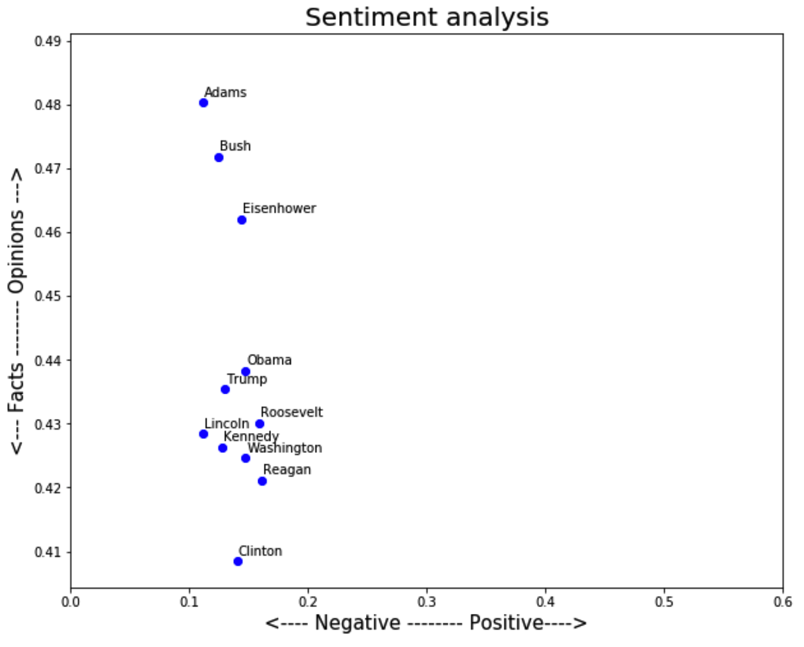
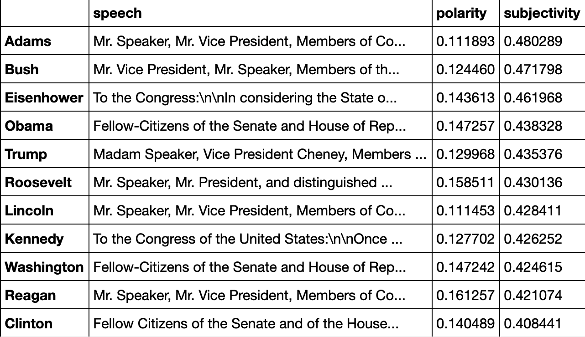

# State-of-the-nation
Analysis of American presidents state of the nation speech. This is the another part of the iternal tool (see [see here for another part](https://github.com/chenmargalit/Text-classification). A more classical (yet very insightful) text analysis using:
* Sklearn
* Scipy
* Gensim
And a few other tools

For example a sentiment analysis of the text:

Polarity/Subjectivity of the text

